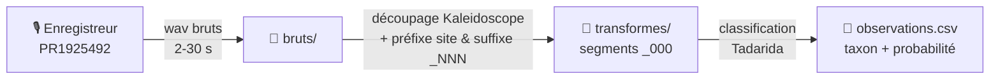

# Exemple : une nuit de capture VigieChiro

Jeu de données **exemple** pour la SAE 2.01 (VigieChiro). Il représente une nuit
complète d'enregistrement acoustique de chauves-souris, telle que produite sur le
terrain par le protocole **Point fixe** du programme [VigieChiro](https://www.vigienature.fr/fr/chauves-souris).

Ce dépôt sert de jeu de test réaliste pour développer l'interface d'extraction et de
manipulation des données capteurs : votre application doit pouvoir lire l'arborescence,
parser le fichier d'observations et rejouer les segments audio.

> [!IMPORTANT]
> Ce dépôt ne contient qu'un **échantillon** des fichiers audio (56 `.wav`, ~165 Mo),
> choisi pour couvrir tous les taxons détectés. La nuit complète (environ 3 700 `.wav`,
> 11 Go) est archivée sur Zenodo, DOI [10.5281/zenodo.20492247](https://doi.org/10.5281/zenodo.20492247).
> Les fichiers de métadonnées (`observations.csv`...) sont en revanche **complets** :
> ils décrivent toute la nuit, y compris les enregistrements non inclus ici.

## Contexte de la capture

| Champ | Valeur |
|---|---|
| Site / passage | `Car640380` - passage 2 - zone 1 (`Pass2-Z1`) |
| Enregistreur | Passive Recorder, n° de série **PR1925492**, firmware V1.01 |
| Protocole | Point fixe, bande passante 8-120 kHz, échantillonnage 384 kHz |
| Fenêtre d'acquisition | 20:25 -> 07:47 |
| Nuit | du 22 au 23 avril 2026 |
| Détections | 4031 observations, dont ~1069 chauves-souris (16 espèces) |

## La chaîne de traitement



1. L'enregistreur capture des `.wav` bruts dès qu'un son ultrasonore franchit le seuil de déclenchement (`bruts/`).
2. Le logiciel Kaleidoscope découpe chaque enregistrement en segments centrés sur les cris (`transformes/`). Cette étape **renomme** aussi les fichiers : elle ajoute en tête le préfixe de campagne `Car640380-2026-Pass2-Z1-` (site / passage / zone) et en queue un suffixe de segment `_000`, `_001`...
3. Le classifieur **Tadarida** attribue à chaque segment un taxon et une probabilité, consignés dans `observations.csv`.

> Les fichiers intermédiaires propres à Kaleidoscope (`meta.csv`, `log.txt`,
> `settings.ini`) ont été retirés : ils ne servent pas à la SAE et contenaient des
> chemins machine personnels.

## Arborescence

```
.
├── README.md
├── LICENSE                       # CC BY 4.0
├── LogPR1925492.txt              # journal de l'enregistreur (démarrage, batterie, paramètres)
├── PaRecPR1925492_THLog.csv      # température / humidité, un relevé toutes les 10 min
├── bruts/                        # enregistrements bruts (échantillon)
│   └── PaRecPR1925492_AAAAMMJJ_HHMMSS.wav   # nommage natif de l'enregistreur, sans préfixe
└── transformes/
    ├── Car640380-...-PaRecPR1925492_AAAAMMJJ_HHMMSS_NNN.wav   # segments
    ├── observations.csv          # COMPLET : 4031 détections de la nuit
    └── observations_Vu.csv       # idem, variante "vu / validé"
```

### Convention de nommage

Le nom évolue entre le brut et le transformé. Le **brut**, tel que produit par
l'enregistreur (dans `bruts/`), ne porte que l'identifiant PR, la date et l'heure :

```
PaRecPR1925492_20260422_202623.wav
└── PR ──┘ └─ date ─┘└heure┘
```

Le **transformé** (segment dans `transformes/`, et nom référencé dans `observations.csv`)
ajoute un préfixe de campagne en tête et un suffixe de segment en queue :

```
Car640380-2026-Pass2-Z1-PaRecPR1925492_20260422_202623_000.wav
└──────── site / passage / zone ───────┘└── PR ──┘ └─ date ─┘└heure┘└seg┘
```

- `AAAAMMJJ_HHMMSS` : date et heure de début de l'enregistrement brut.
- Le découpage ajoute **deux choses** au nom du brut : le préfixe `Car640380-2026-Pass2-Z1-` (site / passage / zone, métadonnée de campagne) **en tête**, et le suffixe `_NNN` (numéro du segment, `_000` pour le premier) **en queue**.
- Pour retrouver le brut d'un segment, il faut donc retirer **le préfixe `Car640380-2026-Pass2-Z1-` ET le suffixe `_NNN`** : `Car640380-2026-Pass2-Z1-PaRecPR1925492_..._000.wav` → `PaRecPR1925492_....wav`. Tous les segments n'ont pas forcément leur brut conservé : votre application doit gérer ce cas.

> Dans la donnée d'origine, les fichiers d'observations portent un préfixe technique
> `<hash>-participation-<id>-observations.csv`. Ils ont été renommés `observations.csv`
> et `observations_Vu.csv` pour la lisibilité ; votre application peut les retrouver via
> le motif `*observations*.csv`.

## Format de `observations.csv`

Séparateur `;`, valeurs entre guillemets, encodage UTF-8. Une ligne par cri détecté
(un même fichier peut donc apparaître plusieurs fois).

| Colonne | Description |
|---|---|
| `nom du fichier` | nom du segment transformé (`transformes/`), **avec** le préfixe de campagne, sans extension `.wav` |
| `temps_debut` | début du cri dans le segment (secondes) |
| `temps_fin` | fin du cri (secondes) |
| `frequence_mediane` | fréquence médiane du cri (kHz) |
| `tadarida_taxon` | taxon proposé par Tadarida (code à 6 lettres, voir ci-dessous) |
| `tadarida_probabilite` | indice de confiance Tadarida (0 à 1) |
| `tadarida_taxon_autre` | second taxon candidat éventuel |
| `observateur_taxon` | taxon corrigé par l'observateur (souvent vide) |
| `observateur_probabilite` | confiance de l'observateur |
| `validateur_taxon` | taxon confirmé par un validateur (souvent vide) |
| `validateur_probabilite` | confiance du validateur |

Les codes Tadarida suivent la convention **3 premières lettres du genre + 3 de l'espèce**
(`Pippip` = *Pipistrellus pipistrellus*). Le référentiel complet est maintenu par le
programme VigieChiro.

### Chauves-souris détectées cette nuit (16 espèces)

| Code | Espèce | Nom français | Détections |
|---|---|---|---:|
| `Pippip` | *Pipistrellus pipistrellus* | Pipistrelle commune | 638 |
| `Nyclei` | *Nyctalus leisleri* | Noctule de Leisler | 139 |
| `Tadten` | *Tadarida teniotis* | Molosse de Cestoni | 89 |
| `Rhihip` | *Rhinolophus hipposideros* | Petit rhinolophe | 80 |
| `Rhifer` | *Rhinolophus ferrumequinum* | Grand rhinolophe | 40 |
| `Pipkuh` | *Pipistrellus kuhlii* | Pipistrelle de Kuhl | 38 |
| `Myomys` | *Myotis mystacinus* | Murin à moustaches | 11 |
| `Myonat` | *Myotis nattereri* | Murin de Natterer | 7 |
| `Eptser` | *Eptesicus serotinus* | Sérotine commune | 7 |
| `Myoema` | *Myotis emarginatus* | Murin à oreilles échancrées | 6 |
| `Pippyg` | *Pipistrellus pygmaeus* | Pipistrelle pygmée | 4 |
| `Pipnat` | *Pipistrellus nathusii* | Pipistrelle de Nathusius | 3 |
| `Minsch` | *Miniopterus schreibersii* | Minioptère de Schreibers | 3 |
| `Barbar` | *Barbastella barbastellus* | Barbastelle d'Europe | 2 |
| `Nycnoc` | *Nyctalus noctula* | Noctule commune | 1 |
| `Myodau` | *Myotis daubentonii* | Murin de Daubenton | 1 |

### Autres taxons

Tadarida classe aussi des sons non chiroptères. On trouve dans cette nuit du bruit
(`noise`, 2102), des oiseaux (`piaf`, 649), des orthoptères (sauterelles, grillons :
`Tetvir`, `Phanan`, `Phogri`, `Rusnit`, `Leppun`...) et quelques autres codes
résiduels. Pour une IHM de saisie naturaliste, on filtre généralement sur les espèces
de chauves-souris.

## Journaux de l'enregistreur

- `LogPR1925492.txt` : démarrage, niveau de batterie, paramètres d'acquisition, mises en veille / réveils.
- `PaRecPR1925492_THLog.csv` : `Date`, `Hour`, `Temperature` (°C), `Humidity` (%), un relevé toutes les 600 s.

Ces journaux fournissent un contexte environnemental utile (l'activité des chauves-souris
varie avec la température) et ne sont pas indispensables au cœur de l'application.

## Licence

Données diffusées sous licence [Creative Commons Attribution 4.0 (CC BY 4.0)](https://creativecommons.org/licenses/by/4.0/deed.fr).
Voir le fichier [LICENSE](LICENSE). Merci de citer le programme VigieChiro / Vigie-Nature
(Muséum national d'Histoire naturelle) comme source.
